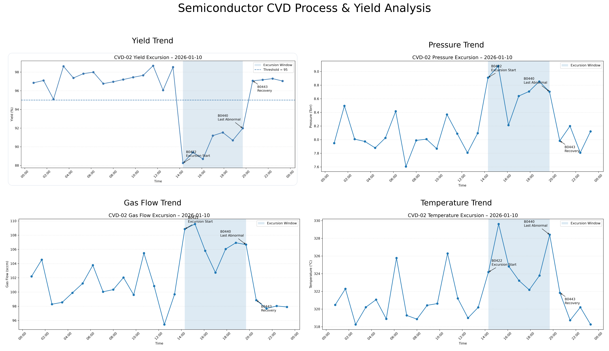

# Semiconductor Equipment Process Monitoring & Yield Analysis

This project simulates a semiconductor CVD process monitoring environment. Using Python and a 500-batch synthetic dataset, it examines relationships between process parameters and wafer yield, compares normal and abnormal batches, and turns process trends into a structured engineering investigation.

**Engineering Portfolio:** [Open detailed semiconductor process monitoring report](https://eros424.github.io/semiconductor-cvd-yield-analysis/docs/portfolio.html)

## Project Overview

Chemical vapor deposition (CVD) forms thin films on wafers. Stable chamber conditions and consistent film properties matter for process repeatability. This project follows batch records across CVD tools, flags batches with yield below 95%, and investigates whether parameter shifts coincide with the lower-yield period.

The dataset is simulated. The analysis demonstrates a monitoring and troubleshooting workflow; it does not establish a production root cause.

## CVD Process Background

The monitored variables are **Temperature**, **Pressure**, **Gas Flow**, **Film Thickness**, and **Process Time**. Changes in these conditions may affect deposition rate, film uniformity, defects, and ultimately yield. Film thickness is an observed process outcome, while temperature, pressure, gas flow, and process time are potential control variables.

## Engineering Analysis Method

1. **Data Cleaning:** Load batch records and check fields, timestamps, and missing values.
2. **Statistical Analysis:** Summarize yield and parameter distributions; compare batch groups.
3. **Parameter Correlation Analysis:** Screen for associations that merit investigation.
4. **Normal vs Abnormal Batch Comparison:** Label yield below 95% as abnormal, then compare parameter values.
5. **Process Trend Monitoring:** Review time-ordered charts by tool to locate excursions and recovery.

## Monitoring Evidence

The four charts below follow CVD-02 on 2026-01-10. The highlighted interval is an investigation window, not a confirmed equipment fault.

| Chart | Purpose | Engineering interpretation |
| --- | --- | --- |
| [Yield Trend](results/yield_analysis.png) | Identify when yield falls below the 95% monitoring threshold. | Seven of 26 CVD-02 batches that day were below threshold; review the same time window in equipment parameters. |
| [Pressure Trend](results/pressure_analysis.png) | Monitor chamber pressure stability during deposition. | Elevated pressure coincides with lower-yield batches and is a candidate for follow-up, not a proven cause. |
| [Gas Flow Trend](results/gas_flow_analysis.png) | Monitor gas delivery consistency. | Gas flow rises in the excursion window; compare setpoints, recipe, and tool logs before attributing an effect. |
| [Temperature Trend](results/temperature_analysis.png) | Monitor chamber temperature stability. | Temperature shifts in the same period; verify recipe and sensor context before drawing a causal conclusion. |

## Root Cause Analysis Example

**Problem:** Yield variation observed between production batches.

**Method:** Compare critical process parameters between normal and abnormal batches, then inspect the time sequence for CVD-02.

**Parameters:** Temperature, Pressure, Gas Flow, and Film Thickness.

**Finding:** On 2026-01-10, CVD-02 abnormal batches averaged 90.25% yield versus 97.30% for normal batches. Pressure, gas flow, temperature, and measured film thickness were also higher on average. These deviations are investigation leads; the simulated data and mixed recipes do not prove causation.

**Recommendation:** Continue process monitoring and parameter control. Check recipe-specific limits, calibration and maintenance records, then test whether the pattern repeats with additional batches.

## Technical Skills

Python · Pandas · NumPy · Matplotlib · SciPy · Exploratory Data Analysis · Statistical Comparison · Process Monitoring · Yield Analysis

## Repository Structure

- analysis.py — batch analysis and original chart generation
- create_dashboard.py — README dashboard assembly
- data/ — simulated CVD batch records
- results/ — four presentation-ready monitoring charts
- docs/portfolio.html — detailed engineering report
- images/ — original analysis figures and dashboard source assets
- requirements.txt — Python dependencies

**Engineering Portfolio:** [Open detailed semiconductor process monitoring report](https://eros424.github.io/semiconductor-cvd-yield-analysis/docs/portfolio.html)
